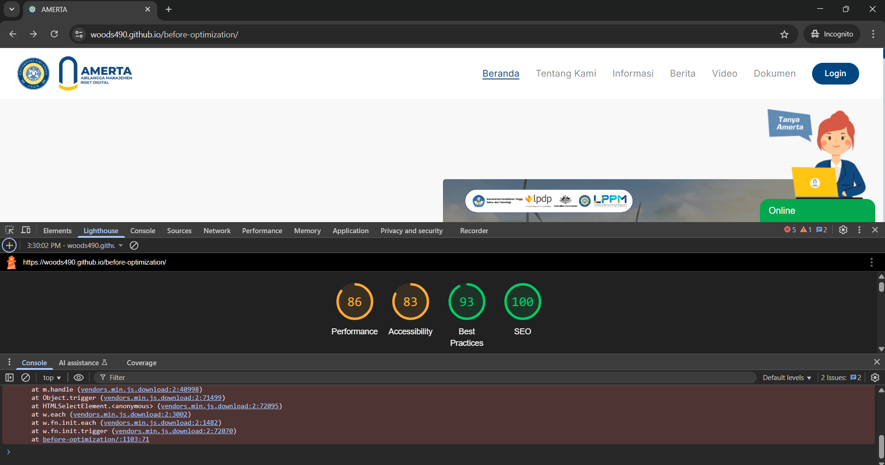
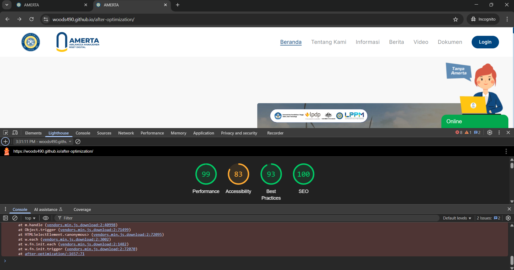

## Demo link 
[Before optimization](https://woods490.github.io/before-optimization)
[After optimization](https://woods490.github.io/after-optimization)

### Screenshots
| Before Optimization | After Optimization |
|:--------------------:|:------------------:|
|  |  |

## Optimization Applied
- Converted images from **PNG** to **WebP** format to reduce file size without sacrificing quality (Unair and Amerta Logo).
- **Eager loaded** and **preloaded** the Largest Contentful Paint (LCP) image to prioritize loading visible content (Hero carrousel content). 
- **Lazy loaded** images and content not immediately in the viewport to improve initial page load performance (Articles that are not immediately visible).
- **Minified** `leaflet.css` using **esbuild** to reduce CSS size and improve rendering speed.
- **Deleted unused assets** to decrease the overall page size and minimize unnecessary network requests.

## Running the project
Simply click the index.html on local and it should open the web browser