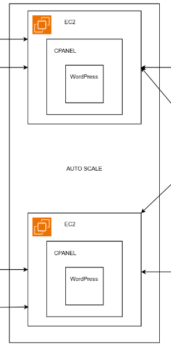
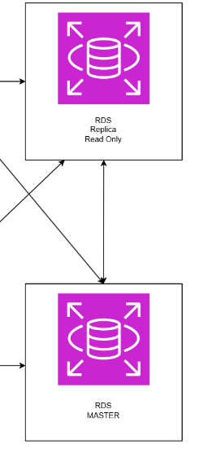
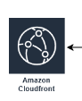

### Explanation

1. Auto Scaling Group for WordPress Instances Running on EC2 with cPanel

In this architecture, an Auto Scaling Group (ASG) manages multiple EC2 instances that run WordPress, with cPanel installed for easier web hosting management.

The ASG ensures that the number of WordPress instances automatically adjusts based on traffic load. When demand increases, more EC2 instances are launched; when demand decreases, unnecessary instances are terminated.

This setup helps maintain high availability and fault tolerance for the WordPress site, ensuring it remains responsive even during traffic spikes.

2. RDS with Master for Write and Slave for Read

The database layer uses Amazon RDS (Relational Database Service) with a Master-Slave replication setup.

    The Master RDS instance handles all write operations (insert, update, delete).

    One or more Slave RDS instances are used to handle read operations (select queries).

This separation of write and read workloads improves performance and scalability, ensuring that database read operations do not overload the primary database.

3. Amazon S3 Bucket for Static Asset in Public Access

All static assets such as images, CSS, JavaScript files, and other media are stored in an Amazon S3 bucket.

The S3 bucket is configured for public access to allow users to directly fetch these assets, reducing the load on the WordPress servers.

By offloading static content to S3, the web servers can focus purely on dynamic content, resulting in better performance.

4. CloudFront for CDN Service

Amazon CloudFront is used as a CDN to cache and deliver content to users around the world.

CloudFront fetches dynamic and static content from the EC2 instances and S3 bucket, making website load times faster for global visitors.